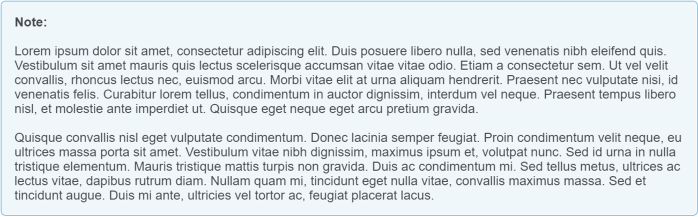

# How to Add Paragraph Spacing Inside of Notes in Madcap Flare

## Context

Notes are a great way of highlighting important information in MadCap Flare. Some notes require long blocks of text that are better broken up yet still contained within the same note block. 

## Process

To create spacing within a note in MadCap Flare follow the following steps:

1. Create a custom div style for notes.
2. Create separate divs nested inside of the note div to separate content. 

The best way to create spacing between paragraphs within the same note in MadCap flare is to create separate divs of content nested inside the parent note div. You can do this easily using the XML editor in MadCap Flare.

Between each separate block of text also add a div that simply adds a space between paragraphs of text. 

## Creating a Note DIV Style

To create styling for content that should be inside of a note, you have to create a custom class in your stylesheet in your MadCap Flare project. Complete the following steps: 

1. In MadCap Flare in the Content Explorer, navigate to **Resources > Stylesheets > [Your Project Stylesheet].css**
2. Right click the CSS file and select **Open with > Internal Text Editor**  
3. Add a definition for the CSS properties for **div.note** content similar to the example below. 
4. Save the changes you made to the stylesheet. 
5. In a project topic, select the content you want to put inside of a note and select the newly created **div.note** style from the style dropdown in the **Styles** window on the **Home** tab. 

### CSS Properties Example

        div.note
        {
            -moz-border-radius: 1em;
            -webkit-border-radius: 1em;
            background-color: #f0f7fb;
            border: solid 1px #3498db;
            border-radius: 6px;
            line-height: 18px;
            mc-auto-number-format: '{b}Note: {/b}';
            overflow: hidden;
            padding-bottom: 1em;
            padding-left: 1em;
            padding-top: 1em;
            padding-right: 1em;
        }

### Basic Note Example

## Separating Content Within a Note

1. Right-click on your topic in the MadCap Flare File Explorer.
2. Edit your topic using the Text Editor. 
3. Insert a code snippet similar to the code sample below. 

**Note:** Use the following line to create spacing between paragraphs within the note div: 

    
&#160;

## Code Sample of Div with Spacing

    

        
 Lorem ipsum dolor sit amet, consectetur adipiscing elit. Duis posuere libero nulla, sed venenatis nibh eleifend quis. Vestibulum sit amet mauris quis lectus scelerisque accumsan vitae vitae odio. Etiam a consectetur sem. Ut vel velit convallis, rhoncus lectus nec, euismod arcu. Morbi vitae elit at urna aliquam hendrerit.  Praesent nec vulputate nisi, id venenatis felis. Curabitur lorem tellus, condimentum in auctor dignissim, interdum vel neque. Praesent tempus libero nisl, et molestie ante imperdiet ut. Quisque eget neque eget arcu pretium gravida.

        
&#160;
 
        
Quisque convallis nisl eget vulputate condimentum. Donec lacinia semper feugiat. Proin condimentum velit neque, eu ultrices massa porta sit amet. Vestibulum vitae nibh dignissim, maximus ipsum et, volutpat nunc. Sed id urna in nulla tristique elementum. Mauris tristique mattis turpis non gravida. Duis ac condimentum mi. Sed tellus metus, ultrices ac lectus vitae, dapibus rutrum diam. Nullam quam mi, tincidunt eget nulla vitae, convallis maximus massa. Sed et tincidunt augue. Duis mi ante, ultricies vel tortor ac, feugiat placerat lacus.

    

## Result

The note from the above code will appear as follows in MadCap Flare:

