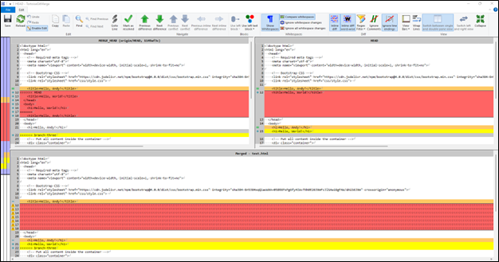
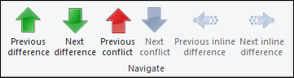

# How to Resolve Merge Conflicts in TortoiseGit

## Introduction
Resolving merge conflicts is an inevitable part of using Git and can be tricky for new users. TortoiseGit offers a helpful interface for resolving conflicts. 

## Resolving a Merge Conflict
Merge conflicts occur when you merge two branches that have different versions of the same file. If you have conflicting changes when you merge branches in TortoiseGit you will see the following two screens:

To begin resolving the merge conflict click **Resolve**.

**Note:** You can also click the dropdown arrow and select stash to stash the changes in your current working directory.

The following window displays all the files that have an existing conflict.

Double-click a file in the list to bring up the following screen which allows you to resolve the merge conflicts. 

The above window shows three versions of the conflicted file:

1. **HEAD** is the file as it appears in your current branch.
2. **MERGE_HEAD** is version of the file from the other branch. 
3. **Merged** is a version of the file that contains changes from both branches.

You can scroll through each of the differences and conflicts using the arrows under **Navigate**. 

## Selecting the Version You Want to Keep

You have several options for selecting the text block or file you want to keep. The two most common ways are: 
Right-click on a version of the file. In the context menu, select which text block, whole file, or order of text blocks to use.

Select one of the options under Blocks to choose which text block to use. 

Once you have selected the file or text block you want to use, click Mark as Resolved then click Save. Close the merge window. 

Once you have resolved all files that contained merge conflicts, the file list in this window will be empty:

Close this window then commit and push the changes from resolving the merge conflicts.